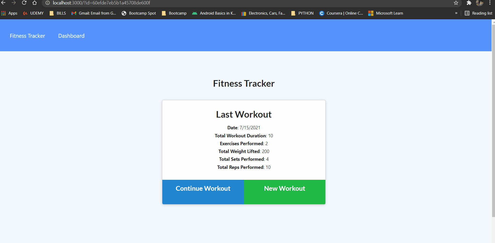

# workout-tracker-5000

## Description

This app is a workout tracker in which you can enter any workout, or multiple exercises per workout. You can then view a Graph Dashboard shoing progress from day to day.

## Instructions

No installation necessary to use app, just navigate to https://workout-tracker5000.herokuapp.com/ for live deployment.

To use this application locally, you must clone the repository and set up environment variables. You must run `npm install` from the command line to install the necessary dependencies. You can create your own local mongo database and use the command `npm run seed` to seed the database with starter info. To start the app, run `npm start` in the command line and go to localhost:3000 on you web browser.  This app is planned for deployment to Heroku, but as of now it is unable to be deployed.

